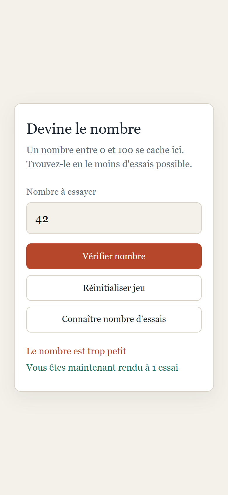

# guess-the-number

A number between 0 and 100 is drawn when the page loads. Type a guess, and the
page tells you whether the secret is higher or lower, until you land on it.

One script, no JavaScript library, no build step: open the file and play.

> The user interface is in French, as is the code vocabulary. This README and
> the repository metadata are in English.

## Screenshots

## How it works

**The whole game is two numbers.** The secret and the attempt count live in two
variables at the top of `js/devine.js`. Every button reads or resets them;
nothing else holds state.

**Guesses go through the form, not the button.** The check button is a submit
button and the handler listens to the form's `submit` event, so pressing Enter
in the field plays a turn exactly as clicking does. `preventDefault` keeps the
page from reloading.

**Bad input is refused before it counts.** A number field still lets an empty
value, a decimal or a value outside 0 to 100 through. `lireSaisie` rejects
those and shows a message; the attempt counter only moves on a real guess.

**Two lines, two jobs.** The red line is for hints and refusals, the green one
for the attempt count and the win. Asking for the count leaves the current
hint in place, so you can read both at once.

**Winning locks the field until you reset.** Once the number is found, the
field and the check button are disabled. Reset draws a new secret, clears both
lines, re-enables everything and puts the cursor back in the field.

## Running it

Open `index.html` in a browser. There is nothing to install.

## Stack

HTML, CSS with Bootstrap 5.1 for the grid and the form controls, and vanilla
JavaScript. One script, no JavaScript library.

## Résumé

Jeu de devinette en JavaScript sans dépendance : la page tire un nombre entre
0 et 100 au chargement, et chaque proposition reçoit un indice, trop petit ou
trop grand, jusqu'à ce que le nombre soit trouvé. L'état tient en deux
variables, le nombre secret et le compte des essais. Le formulaire écoute
l'événement `submit`, ce qui fait jouer la touche Entrée comme le bouton. Une
saisie vide, décimale ou hors bornes est refusée avant d'être comptée. Deux
lignes se partagent l'affichage, l'une pour les indices et les refus, l'autre
pour le compteur et la victoire ; consulter le compteur laisse l'indice en
place. La victoire verrouille le champ jusqu'à la réinitialisation, qui tire
un nouveau nombre et remet tout à zéro. Interface et vocabulaire du code en
français.

## Licence

MIT. See [LICENSE](LICENSE).
